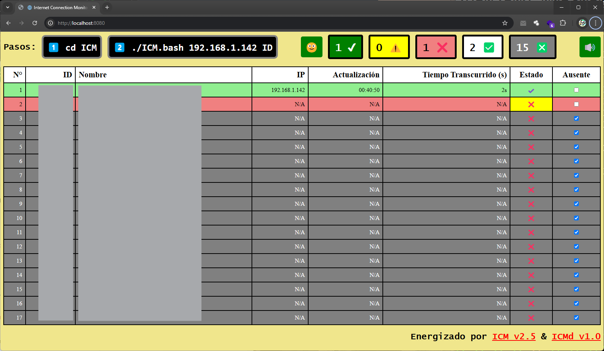

# 🌐 Internet Connection Monitor daemon (ICMd) 🔌

|Version|Timestamp|Updated on OS|Supported on OS|
|--:|--:|:--:|:--:|
|`2.5`|`2026-06-08 02:40`|🍎|🍎🪟|

## **Real-Time Client Monitoring Dashboard**  

This dashboard provides real-time monitoring of connected clients, displaying their status based on recent updates. Each client is identified by an **ID, name, IP address, last update timestamp, and elapsed time since the last update**.  

## **Key Features**  

✅ **Traffic Light System** – Clients are color-coded based on their last update time:  
   - 🟢 **Green** (Recently updated)  
   - 🟡 **Yellow** (Moderate delay)  
   - 🔴 **Red** (Critical delay)  

✅ **Status Tracking** – Displays whether a client's condition has been met.  

✅ **Server Connection Indicator** – Shows if the backend is reachable:  
   - 🟢 **Connected**  
   - 🔴 **Disconnected**  

✅ **Alarm System** – Plays a sound when a critical condition is detected.  

✅ **Ignore Functionality** – Clients can be marked as ignored, preventing them from affecting alerts and status colors.  

✅ **Global Background Color** – The dashboard background adapts to the most critical client state.  

✅ **Persistent Settings** – Ignored clients are stored in **localStorage** and synced with the backend on page load.  

✅ **Counters** – Displays statistics such as:  
   - Total **active/inactive** clients  
   - Number of clients in each status category (**OK, Warning, Critical**)  

✅ **Shared Content Directory** 🆕

A configurable external directory (environment variable: SHARED\_DIR) can be used to publish content through the web application. Files placed in this directory are automatically available to authorized users and may include:

- HTML pages
- Images
- PDF documents
- Other approved static resources

Because the directory is located outside the repository, content can be updated independently of the application source code and deployment process.

This system ensures **efficient client tracking, immediate status awareness, and a clear visual representation of critical conditions**. 🚀

# How to use it:

1. ## 💾 Install **ICMd** using **CMD** on **🪟Windows** or **Terminal/iTerm** on **🍎MacOS**:
  
    `git clone https://github.com/nelbren/ICMd.git`

2. ## 💿 Switch to the ICM directory:

    `cd ICMd`

3. ## 🛠️ Install python virtual environment and required modules

    - ### **🪟Windows**:
        `install.bat`

    - ### **🍎MacOS**:
        `./install.bash`

4. ## 🎚️ Configure Canvas Access Settings

    - ### **🪟Windows**:
        `config.bat`

    - ### **🍎MacOS**:
        `./config.bash`

5. ## 🏃 Run the program:

    - ### **🪟Windows**:
        `run.bat`

    - ### **🍎MacOS**:
        `./run.bash`

6. ## 🌐 Go to the page and 🧙 Wait for the magic!
   
   

MADE WITH 💛 BY NELBREN

